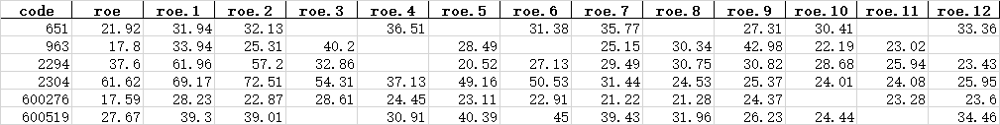

# 1. how to find a good company

## 1.1. 陈述
        通过哪些特征指标可以体现出可能存在发展潜力的公司? 而且是假设这些指标是真实的，不存在财务造假的情况
    其中净资产收益率ROE可以体现一个公司的盈利能力，但是这里有个情况是：公司每年的收益不应当进行不合理的分红，如果假设所有的收益用来分红，那么实际上该公司每年的ROE很高，
    但是基于的分母没变，即净资产没有增加的情况下，是体现不出公司的成长性的，更不会体现出复利的魔力，公司的再投资能力体现了公司的成长性。
    应当说明一点的是：股票的价格与ROE是脱离的，ROE不体现在股价上，但是在深层次上却反映了公司的价值。

        基于上述的一些结论，我们可以进行一些合理的假设：
    好公司的发现，先将股价放在一边不要去考虑，股价部分是投资投机者的情绪的反应，很多时候与公司的价值是不相符的，正式这种信息不对称的情况，投资才有正真的意义，
    做一个独立思考的人。把问题从复杂的茧，抽丝剥离出来，这样你会变得容易的多，当然这个过程是想当复杂的。
    1、单纯的看ROE并不能真正的体现一个公司的盈利能力，需要结合该公司的净资产的增长率等一些指标来看。（利润再投资转化率）单单从这两个指标筛选会有什么缺陷，哪些缺陷会致命的，不妨大胆假设！但是通过这些指标会漏过成长性潜力很大的公司。特别是互联网公司
    2、给出第二个指标：ROE的增长率，由于公司的利润存在再分配的情况，所以该指标很难体现出一定的价值。其实跟第一点本质是一致的。
    3、如何筛选或者说怀疑一个公司的财务造假（在我统计分析数据的时候发现，一般新股刚上市的公司的财务报表都很好看，是不是其中存在猫腻呢？）
    4、一个行业的发展是有周期的，如何确认行业的发展问题。其实很多行业的未来发展是很明确的，不变的是人心，变化的是发展
    5、不同行业肯定依赖不能的技能：科技行业讲究技术，食品行业讲究营销，这就叫专业，需要发现不同领域的公司对应最应该加持的专业的能力是如何的？

## 1.2. 先找很会产奶的奶牛
        很会产奶的奶牛，一般是行业的龙头，有着稳定的收益，稳定的增长。找这一方面的公司可以看ROE指数。这一类的公司一般很好找，只是大家都能找到，所以最重要的一点就是，
    股价是否是合理反应了当前的价值，是否已经透支了未来。
### 1.2.1. 如何筛选这一类公司
        用指标说话。ROE指标：给定上市公司的上市时间范围yxxxx-y2019为n年，这之间的数据确保ROE（n）> 15%，或者存在某一年的数据是负值，ROE（n-1）> 15%，或者ROE(n-2) > 15%等等。
        是否可以进一步进行筛选，ROE的增长率指标：可以反映该公司是在增长的哪一个阶段。
        用该方法在一个将长上市时间的维度进行筛选，结果比较与预测相一致，以下图表筛选的指标为：ROE >= 20,时间从2006年到2018年

        *注：表格中部分数据为空，原因为数据源对应的数据丢失导致，此数据丢失项进行忽略*
### 1.2.2. 确认筛选结果避免踩坑
        很多时候，你看的只是别人造的数据，所以你要去了解公司，这是一个需要时间的事情。

## 1.3. 未来很会产奶的牛犊
        这一类公司是相当难找的，根据目前的A股制度，一般在A股上很难有这种上市公司，所以基本上可以死了这条心。但是万一有呢，所以我们还是要努力，要有发现美的眼睛。

## 1.4. 瞎想
    如果你是要在一个3年的长期目标看一个公司的股价的估值，那么可以通过一个合理的估值，再通过三年的增长率的换算可以得出大概三年的股价的合理价位是多少。
    没有公司会飞到天上去，就像苹果迟早会有一天掉落在地上，只是时间问题。
    一旦一个公司铸造起了行业壁垒，超额收益就会体现。
    资本家：开公司目的是赚钱，赚更多的钱，所以公司不断扩大。
    纸上得来终觉浅，绝知此事要躬行